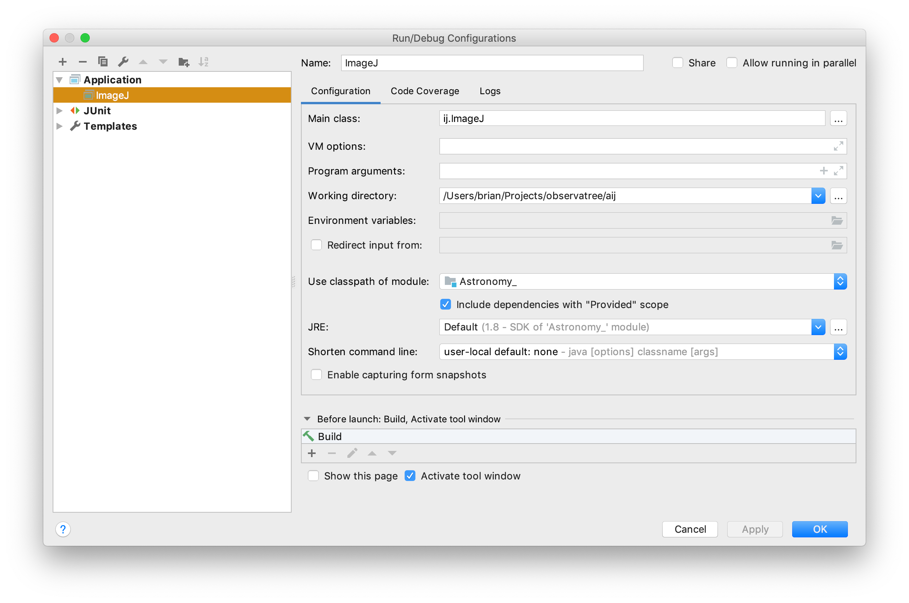

Debugging
=========

The main class in ij.jar is ij.ImageJ. Something like `java -cp target/ij-4.0-SNAPSHOT ij.ImageJ` will execute the artifact. However, that isn't sufficient for developing and debugging plugins.

The authors of ImageJ offer a strategy for debugging plugins: [Debugging ImageJ plugins](https://imagej.net/Debugging_Exercises#Exercise_4:_ImageJ_plugins). However, this strategy, which is based on the way plugins are found after a full installation, is primitive insofar as it requires rebuilding and installing a plugin jar after every code change.

A better scheme is to modify the plugin-loader to find an occurrence of `plugins.config` on the class path and load that. In the ImageJA sources, new code doing this is in `src/main/java/Menus.java` and the new method is `installDevelopmentPlugins()`. The corresponding plugin classes will also be found simply by being on the classpath.

Below is a Run/Debug Configuration (the screenshot is from IntelliJ IDEA, but Eclipse and NetBeans have analogous functionality):

Note that the main class is ij.ImageJ. The working directory is at present irrelevant. Notice that we use the
classpath of the module Astronomy_. Notice that we have to include dependencies with Provided scope. This is typical
during development when we haven't deployed into a container (in this case the thing playing the role of the
container is ImageJ).

If you have allowed your IDE to infer dependencies from the pom.xml files in the submodules, 
there should be no other build and debug configuration necessary.

Once you have debugging working well, it may also be helpful to have
profiling set up too. See [Profiling.md](./Profiling.md).
