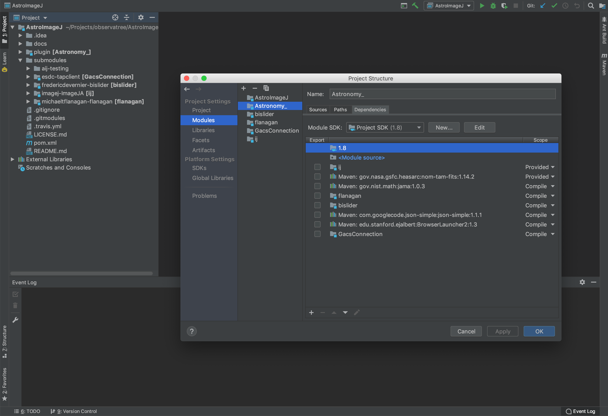

Development Environment
=======================

This file describes two ways of setting up a development
environment. The first presumes familiarity with the command line. The
second relies on the IntelliJ IDEA Ultimate user interface to accomplish
the same operations. Although IntelliJ IDEA Ultimate is a commercial
product, JetBrains has made it free for academics.

The two ways are not mutually exclusive. Quite the contrary, they strongly
complement each other.

However, the IntelliJ IDEA Ultimate directions are written so
as to be self-contained, and you can skip over the next
section if you don't desire to have a command-line environment.

Getting a Command-Line Development Environment
----------------------------------------------

We need Git, Java and Maven. Just Google for getting Git running on your platform.

For Java and Maven, there are a lot of ways to proceed. The easiest uses SDKMAN.

For macOS and Linux, SDKMAN just works with no prerequiste steps. Do the following:

* Get [SDKMAN](https://sdkman.io/install). SDKMAN has a cute way of bootstrapping itself into existence.
* Then use SDKMAN to get the latest Java 8 (at present, 8.0.192-zulu).
This consists of doing `sdk list java` to confirm the most latest version number and then `sdk install java 8.0.192-zulu`.
* Analogously, use SDKMAN to get Maven. As of this writing (2019-01-05), the current version is 3.6.0.

For Windows, SDKMAN requires Cygwin as a prerequisite.

See [Debugging.md](./Debugging.md) for further information on setting 
up a development environment. The above is already sufficient to do builds.

Getting an IntelliJ IDEA Ultimate Development Environment
---------------------------------------------------------

Begin the process of getting an academic license. It may take a few days to approve.
In the meantime, download and install the Ultimate Edition
and use the 30-day free trial. The installation is simple and standard. I declined 
having IntelliJ install a JetBrains variant of the JDK. Instead we'll install our own below.

Although you are not going to use Git from the command-line, IntelliJ still needs you to 
install it.

Therefore, go to [git-scm.com](git-scm.com) and download Git. For Windows,
the direct link is: [Windows Git download page](https://git-scm.com/download/win).
You want the "64-bit Git for Windows" setup.

Since we declined the JetBrains JDK, go to Oracle's
[JDK 8 download page](https://www.oracle.com/technetwork/java/javase/downloads/jdk8-downloads-2133151.html).
It is perhaps confusing that there is currently an 8u191 and an 8u192
build of the JDK. Unless, you are controlled by a timid IT department,
the higher one is better, because it has more fixes.

Install JDK 8u192 or whatever is the latest-greatest JDK 8. (Obviously this is
not required if you have already completed the command-line development environment,
and you will instead use the JDK previously installed by SDKMAN.)

For both Git and the JDK, make note of where they were installed
because IntelliJ may not automatically find them.  For example, you
may have put them on the D: drive on a Windows machine and IntelliJ
may not look there.

Now launch IntelliJ IDEA Ultimate. It's going to run you
through a bunch of preference choices. On the
"Tune IDEA to your tasks" pane, you really only need Java Frameworks,
Build Tools, Version Controls and Test Tools. All the rest you can
disable for the type of Java application development we are doing.

On the next pane that comes up, select IDE Features Trainer if you are
new to IntelliJ.

## Getting the Project

This project is quite tricky because it has multiple subprojects.

In Git, subprojects are usually stored in submodules. Confusingly
Maven also uses the term modules, and it is often the case
that there git submodules and Maven modules have a one-to-one
correspondence. With luck, understanding this distinction is a 
can that can be kicked down the road.

As of version 2018.3 IntelliJ IDEA makes cloning a project with
git submodules transparent.

IntelliJ IDEA also understands Maven aggregator projects that
inform it of multiple Maven modules.

For the AstroImageJ project, the GitHub URL to clone from is:

```https://github.com/observatree/AstroImageJ```

The subprojects in this project are large. This is because the ImageJA
subproject has many years of changes, and the aij-testing subproject
has hundreds of MB of images. Therefore the clone of the repo will
take many minutes. This process shouldn't be interrupted.

Try to build the project. You will get a warning!

The SDK for the project is not yet
configured! ("SDK" and "JDK" are synonyms in Java projects.)  You will
be prompted to create a new JDK, and then assign it to the
project. You only have to create a new JDK once.  All you are doing is
informing IntelliJ about the location of the JDK you installed
earlier. Once it knows about it, it will index it and make it easy to
assign it to any project.

If something goes wrong, compare the project structure that IntelliJ
has deduced from the various pom.xml files with this project structure:



If the project structure is correct
the only errors or warnings should be deprecation warnings
that might have to be addressed if the project is ported to even more
recent versions of Java.

You are now ready to edit and debug the project. It will be enormously
helpful to get a debugging setup working. One configuration is already 
set up. For the way it was set up, see [Debugging.md](./Debugging.md).
