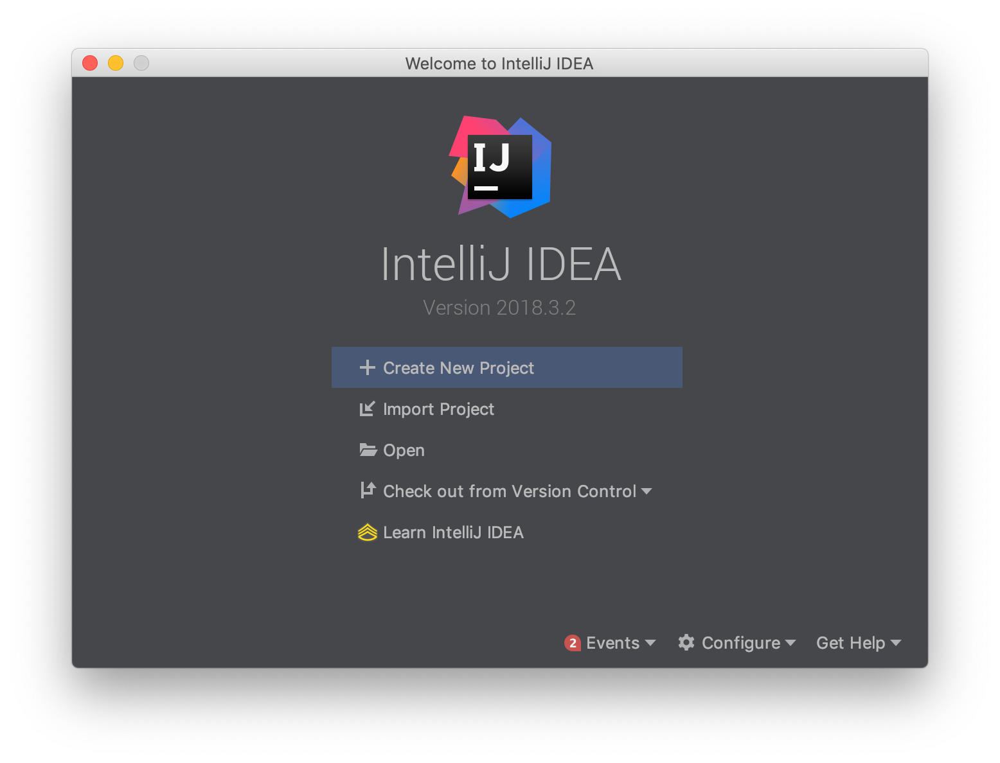
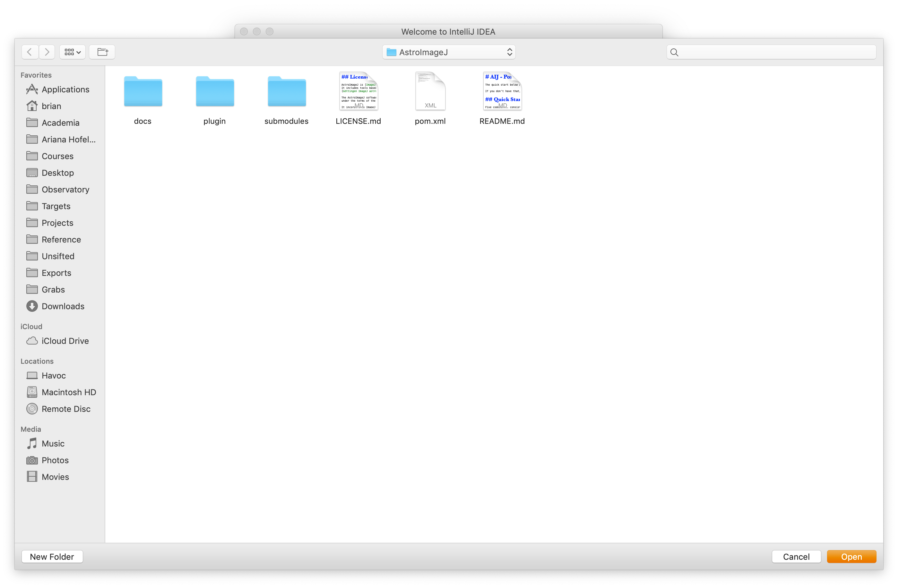

Development Environment
=======================

This file describes two ways of setting up a development
environment. The first presumes familiarity with the command line. The
second relies on the IntelliJ IDEA Ultimate user interface to accomplish
the same operations. Although IntelliJ IDEA Ultimate is a commercial
product, JetBrains has made it free for academics.

The two ways are not mutually exclusive. Quite the contrary, they strongly
complement each other.

The IntelliJ IDEA Ultimate directions are written so
as to be self-contained, and you can skip over the next
section if you don't desire to have a complete command-line environment.

Getting a Command-Line Development Environment
----------------------------------------------

We need Git, JDK 8 and Maven.

First Git. For Windows, the direct link to the relevant page on the git-scm website is: [Windows Git downloads](https://git-scm.com/download/win).
You want the "64-bit Git for Windows" setup. On macOS, the most mainstream way to get Git is as part of the Xcode
command-line tools. This is begun with `$ xcode-select --install`. On other Linux/Unix variants, the direct link to
relevant page is [Linux/Unix Git downloads].

For Java and Maven, there are a lot of ways to proceed. The easiest uses SDKMAN.

For macOS and Linux, SDKMAN just works with no prerequiste steps. Do the following:

* Get [SDKMAN](https://sdkman.io/install). SDKMAN has a cute way of bootstrapping itself into existence.
* Then use SDKMAN to get the latest JDK 8 (at present, 8.0.192-zulu).
This consists of doing `sdk list java` to confirm the most latest version number and then `sdk install java 8.0.192-zulu`.
* Analogously, use SDKMAN to get Maven. As of this writing (2019-01-05), the current version is 3.6.0.

For Windows, SDKMAN requires Cygwin as a prerequisite.

The above installations are sufficient to complete the [Quick Start](../docs/README.md#quick-start).

Getting an IntelliJ IDEA Ultimate Development Environment
---------------------------------------------------------

As noted avove, these IntelliJ IDEA Ultimate directions are self-contained and,
and some of the steps are already done if you completed the command-line development environment above.

We need IntelliJ IDEA, Git and JDK 8. IntelliJ IDEA includes Maven. In fact, it can also be configured
to include a JDK, but we will decline that.

Begin the process of getting an academic license. It may take a few days to approve.
In the meantime, download and install the Ultimate Edition
and use the 30-day free trial. The installation is simple and standard. 

During the Installation, decline having IntelliJ install a JetBrains variant of a JDK.
For uniformity with the command-line directions, we'll install our own below.

Although you are not going to use Git from the command-line, IntelliJ still needs you to 
install it. For Windows, the direct link to the relevant page on the git-scm website is: [Windows Git downloads](https://git-scm.com/download/win).
You want the "64-bit Git for Windows" setup. On macOS, the most mainstream way to get Git is as part of the Xcode
command-line tools. This is begun with `$ xcode-select --install`. On other Linux/Unix variants, the direct link to
relevant page is [Linux/Unix Git downloads].

For the JDK 8, since we declined the JetBrains JDK, go to Oracle's
[JDK 8 download page](https://www.oracle.com/technetwork/java/javase/downloads/jdk8-downloads-2133151.html).
It is perhaps confusing that there is currently an 8u191 and an 8u192
build of the JDK. 8u191 is for people controlled by timid IT departments.
You want 8u192, because it has more fixes.

Install JDK 8u192 or whatever is the latest-greatest JDK 8.

For both Git and the JDK, make note of where they were installed
because IntelliJ may not automatically find them.  For example, you
may have put them on the D: drive on a Windows machine and IntelliJ
may not look there.

Now launch IntelliJ IDEA Ultimate. It's going to run you
through a bunch of preference choices. On the
"Tune IDEA to your tasks" pane, you really only need Java Frameworks,
Build Tools, Version Controls and Test Tools. All the rest you can
disable for the type of Java application development we are doing.

On the next panel that comes up, select IDE Features Trainer only.

## Getting the Project

This project is tricky because it has multiple subprojects.

In Git, subprojects are usually stored in submodules. Confusingly
Maven also uses the term modules, and it is often the case
that there git submodules and Maven modules have a one-to-one
correspondence. In this documentation, we will
keep them distinct by calling them "submodules" in the Git case, and 
"modules" in the Maven case.

As of version 2018.3 IntelliJ IDEA makes cloning a project with
git submodules transparent.

IntelliJ IDEA also understands Maven aggregator projects that
have multiple Maven modules, and it will search recursively
through a project's source directories looking for the pom.xml
file that defines each Maven module.

For the AstroImageJ project, the GitHub URL to clone from is:

```https://github.com/observatree/AstroImageJ```

The subprojects in this project are large. This is because the ImageJA
subproject has many years of changes, and the aij-testing subproject
has hundreds of MB of images. Therefore the clone of the repo will
take many minutes. This process shouldn't be interrupted.

If you have already put the AstroImageJ sources into a directory during
the command-line directions, all you need to do is open it. That begins by
choosing "Open" in this dialog:



Note that Open is not the default in this panel, you need to select it!
When you have found the right directory to open, the Open Panel will look
like this:



Try to build the project. You will get a warning!

The SDK for the project is not yet
configured! ("SDK" and "JDK" are synonyms in Java projects.)  You will
be prompted to create a new JDK, and then assign it to the
project. You only have to create a new JDK once.  All you are doing is
informing IntelliJ about the location of the JDK 8 you installed
earlier. Once IntelliJ knows about it, it will be easy to
assign it to any project.

If something goes wrong, compare the project structure that IntelliJ
has deduced from the various pom.xml files with this project structure:


If the project structure is correct
the only errors or warnings should be deprecation warnings
that might have to be addressed if the project is ported to even more
recent versions of Java.

You are now ready to edit and debug the project. It will be enormously
helpful to get a debugging setup working. One configuration is already 
set up. For the way it was set up, see [Debugging.md](./Debugging.md).
