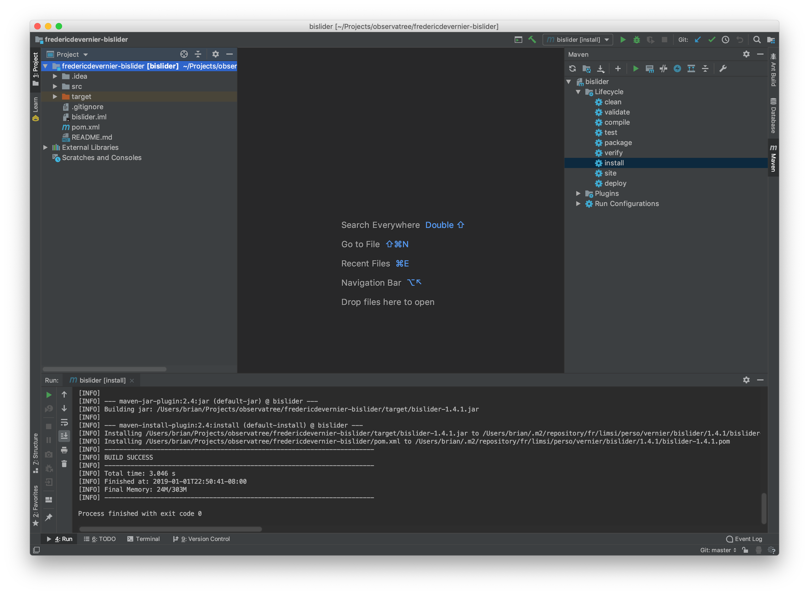

Development Environment
=======================

This file describes two ways of setting up a development
environment. The first presumes familiarity with the command line. The
second relies on the IntelliJ IDEA Ultimate user interface to accomplish
the same operations. Although IntelliJ IDEA Ultimate is a commercial
product, JetBrains has made it free for academics.

The two ways are not mutually exclusive. Quite the contrary, they strongly
complement each other.

However, the IntelliJ IDEA Ultimate directions are written so
as to be self-contained, and you can skip over the next
section if you don't desire to have a command-line environment.

Getting a Command-Line Development Environment
----------------------------------------------

We need Git, Java and Maven. Just Google for getting Git running on your platform.

For Java and Maven, there are a lot of ways to proceed. The easiest uses SDKMAN.

For macOS and Linux, SDKMAN just works with no prerequiste steps. Do the following:

* Get [SDKMAN](https://sdkman.io/install). SDKMAN has a cute way of bootstrapping itself into existence.
* Then use SDKMAN to get the latest Java 8 (at present, 8.0.192-zulu).
This consists of doing `sdk list java` to confirm the most latest version number and then `sdk install java 8.0.192-zulu`.
* Analogously, use SDKMAN to get Maven. As of this writing (2019-01-05), the current version is 3.6.0.

For Windows, SDKMAN requires Cygwin as a prerequisite.

See [Debugging.md](./Debugging.md) for further information on setting 
up a development environment. The above is already sufficient to do builds.

Getting an IntelliJ IDEA Ultimate Development Environment
---------------------------------------------------------

Begin the process of getting an academic license. It may take a few days to approve.
In the meantime, download and install the Ultimate Edition
and use the 30-day free trial. The installation is simple and standard. I declined 
having IntelliJ install a JetBrains variant of the JDK. Instead we'll install our own below.

Although you are not going to use Git from the command-line, IntelliJ still needs you to 
install it.

Therefore, go to [git-scm.com](git-scm.com) and download Git. For Windows,
the direct link is: [Windows Git download page](https://git-scm.com/download/win).
You want the "64-bit Git for Windows" setup.

Since we declined the JetBrains JDK, go to Oracle's
[JDK 8 download page](https://www.oracle.com/technetwork/java/javase/downloads/jdk8-downloads-2133151.html).
It is perhaps confusing that there is currently an 8u191 and an 8u192
build of the JDK. Unless, you are controlled by a timid IT department,
the higher one is better, because it has more fixes.

Install JDK 8u192 or whatever is the latest-greatest JDK 8. (Obviously this is
not required if you have already completed the comman-line development environment,
and you will instead use the JDK previously installed by SDKMAN.)

For both Git and the JDK, make note of where they were installed
because IntelliJ may not automatically find them.  For example, you
may have put them on the D: drive on a Windows machine and IntelliJ
may not look there.

Now launch IntelliJ Idea Ultimate. It's going to run you
through a bunch of preference choices. On the
"Tune IDEA to your tasks" pane, you really only need Java Frameworks,
Build Tools, Version Controls and Test Tools. All the rest you can
disable for the type of Java application development we are doing.

On the next pane that comes up, select IDE Features Trainer if you are
new to IntelliJ.

## The First Project

Let's start with something easy! We will start with the three dependencies that we need to build from source.

In the next window that comes up, click "Check out from Version Control" with Git as your choice. Paste in this URL:

```https://github.com/observatree/michaeltflanagan-flanagan```

You will be get a balloon in the lower-right hand corner of the IDE
window asking whether you want IntelliJ to pay attention to the
project's `pom.xml` file. You most defintely want to say "Yes" to
this! If you overlook or dismiss the balloon, you get another chance.

Typically, the project opens without showing the Project Navigator, click "1:
Project" near the upper left of the window and the navigator will
appear on the left.

This is your second chance to get the InteilliJ to pay attention to
the pom.xml file if you didn't already. Right-click on the root node,
select Maven and then Reimport.

Now build the project. Again, right-click on the root node and choose rebuild.

You will get a warning! The SDK for the project is not yet
configured! ("SDK" and "JDK" are synonyms in Java projects.)  You will
be prompted to create a new JDK, and then assign it to the
project. You only have to create a new JDK once.  All you are doing is
informing IntelliJ about the location of the JDK you installed
earlier. Once it knows about it, it will index it and make it easy to
assign it to any project.

Even though this is a 1.8 JDK, it seems it supports language features
all the way to Java 11, "11 - Local variable syntax for lambda
parameters." If it's actually true, I see no reason not to allow
the most modern language features, so leave that default. On the 
other hand, I don't understand how the JDK 8 can support Java 11
features, so perhaps this is just misleading UI.

The project should build cleanly. In fact, it should build so cleanly
that the build messages window that automatically opens when there
are warnings or errors won't automatically open. At the bottom
of the window, you can click on '0: Messages' to see a few
informational messages about the build.

We also need to install the project's "artifact" which is the
flanagan.jar, so that other projects (the Astronomy_ project) can use
it. This is done by opening the Maven sidebar in the upper right and
running the "install" lifecycle. See screenshot showing the install
lifecycle selected in the upper right, which you right click and run,
and then you'll se the successfully-completed
run of the install lifecyle at the bottom:



What is that doing? It is creating and populating a local Maven repo
with the dependencies our main project needs. The Maven repo has
nothing to do with a Git repo. By default it is located as a hidden
directory under your home directory named ".m2".

## The Next Three Projects

There are three more dependencies that need to be built locally. The GitHub URLs to clone them are:

* ```https://github.com/observatree/fredericdevernier-bislider```
* ```https://github.com/observatree/usnistgov-jama```
* ```https://github.com/observatree/esdc-tapclient```

Repeat the preceding for these three projects. Note that you won't have
to get a JDK since you already have that, but you will have to set it
as the JDK for each project.

To open a new project, select File, then New, then Project from Version Control,
then Git, and then supply one of the above URLs.

Be sure to complete building each project with the Maven install step.

## The AIJ Project

Finally we get to the project we are really interested in.

This project is substantially trickier because it has two subprojects:
the ImageJA project and the Astronomy_ project. In fact, there is a
third subproject devoted to testing (which we don't build)

In Git, subprojects are represented by submodules. With luck, IntelliJ
makes cloning a project with submodules transparent. However, as
time goes on, it will likely be impossible to use Git effectively
entirely through the IDE. In other words it is important to know 
what Git is actually doing.

Additional complexity is that this projects has six dependencies,
three of which you just built as the first three projects above.
If the Maven installs have been done correctly, the additional
complexity will be invisible.

For the AIJ project, the GitHub URL to clone from is:

```https://github.com/observatree/aij```

The subprojects in this project are large. This is because the ImageJA
subproject has many years of changes, and the aij-testing subproject
has hundreds of MB of images. Therefore the clone of the repo will
take many minutes. This process shouldn't be interrupted or you may
end up with incomplete checkouts.

Use the project navigator to open the submodules node. Under it will
be an imagej-ImageJA node. Right click on it. It should build cleanly.

Repeat, but this time right-click on the karenacollins-AstroImageJ
node. It should build cleanly.

You are now ready to edit and debug the project. It will be enormously
helpful to get a debugging setup working. See [Debugging.md](./Debugging.md).
